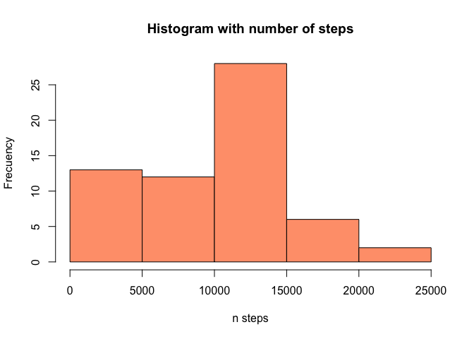
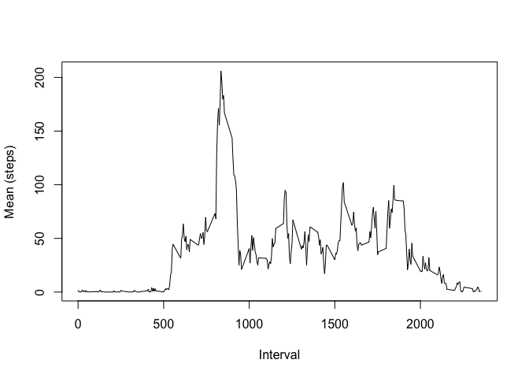
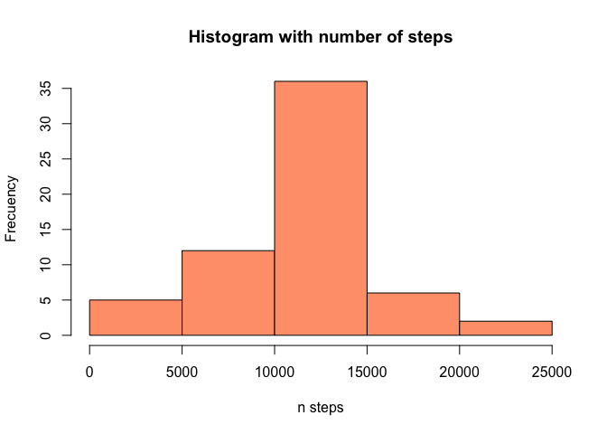
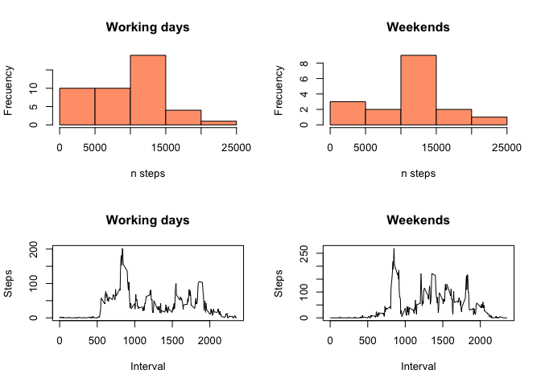

# Reproducible Research: Peer Assessment 1

# My first homework for the course

Ana Monreal Ibero

## Loading and preprocessing the data

1. Load the data
2. Process/transform the data (if necessary) into a format suitable for your analysis


```r
myzip <- "activity.zip"
mydata <- read.csv(unzip(myzip), sep=",", header=TRUE, na.strings="NA", stringsAsFactors = FALSE)
mydate <- as.Date(mydata$date)
str(mydata)
```

```
## 'data.frame':	17568 obs. of  3 variables:
##  $ steps   : int  NA NA NA NA NA NA NA NA NA NA ...
##  $ date    : chr  "2012-10-01" "2012-10-01" "2012-10-01" "2012-10-01" ...
##  $ interval: int  0 5 10 15 20 25 30 35 40 45 ...
```

## What is mean total number of steps taken per day?

For this part of the assignment, you can ignore the missing values in the dataset.

1. Calculate the total number of steps taken per day
2. If you do not understand the difference between a histogram and a barplot, research the difference between them. Make a histogram of the total number of steps taken each day
3. Calculate and report the mean and median of the total number of steps taken per day


```r
mytot <- with(mydata, tapply(steps, date, sum, na.rm = TRUE))

hist(mytot, xlab="n steps", ylab="Frecuency", 
     col="lightsalmon", main="Histogram with number of steps")
```

<!-- -->

```r
mytotmean <- mean(mytot)
mytotmedian <- median(mytot)
paste("The mean total number of steps is ", mytotmean)
```

```
## [1] "The mean total number of steps is  9354.22950819672"
```

```r
paste("The median total number of steps is ", mytotmedian)
```

```
## [1] "The median total number of steps is  10395"
```

## What is the average daily activity pattern?

1. Make a time series plot of the 5-minute interval (x-axis) and the average number of steps taken, averaged across all days (y-axis). 
2. Which 5-minute interval, on average across all the days in the dataset, contains the maximum number of steps?


```r
mymeaninterval <- with(mydata, tapply(steps, interval, mean, na.rm = TRUE))
plot(names(mymeaninterval),mymeaninterval, type="l", xlab="Interval",
     ylab="Mean (steps)")
```

<!-- -->

```r
intervalmax <- names(mymeaninterval[mymeaninterval == max(mymeaninterval)])
paste("The inteval with the maximun number of steps is ",intervalmax)
```

```
## [1] "The inteval with the maximun number of steps is  835"
```
## Imputing missing values

Note that there are a number of days/intervals where there are missing values. The presence of missing days may introduce bias into some calculations or summaries of the data.

1. Calculate and report the total number of missing values in the dataset (i.e. the total number of rows with NAs)


```r
mynan <- apply(mydata, 2, function(x) sum(is.na(x)))
print("the number of rows with NAs for each column is")
```

```
## [1] "the number of rows with NAs for each column is"
```

```r
print(mynan)
```

```
##    steps     date interval 
##     2304        0        0
```
2. Devise a strategy for filling in all of the missing values in the dataset. The strategy does not need to be sophisticated. For example, you could use the mean/median for that day, or the mean for that 5-minute interval, etc.

3. Create a new dataset that is equal to the original dataset but with the missing data filled in.

I do both in the following. I will use the most simplest thing that I can think about: replacing by the global mean.


```r
mymeansteps <- mean(mydata$steps, na.rm=TRUE)
# I copy my original df to a new df
mydatanew <- mydata
mydatanew$steps[is.na(mydata$steps)] <- mymeansteps
mynannew <- apply(mydatanew, 2, function(x) sum(is.na(x)))
print("the number of rows with NAs for each column is")
```

```
## [1] "the number of rows with NAs for each column is"
```

```r
print(mynannew)
```

```
##    steps     date interval 
##        0        0        0
```

4. Make a histogram of the total number of steps taken each day and Calculate and report the mean and median total number of steps taken per day. Do these values differ from the estimates from the first part of the assignment? What is the impact of imputing missing data on the estimates of the total daily number of steps?


```r
mytotnew <- with(mydatanew, tapply(steps, date, sum, na.rm = TRUE))
hist(mytotnew, xlab="n steps", ylab="Frecuency", 
     col="lightsalmon", main="Histogram with number of steps")
```

<!-- -->

```r
mytotmeannew <- mean(mytotnew)
mytotmediannew <- median(mytotnew)
paste("The new mean total number of steps is ", mytotmeannew)
```

```
## [1] "The new mean total number of steps is  10766.1886792453"
```

```r
paste("The new median total number of steps is ", mytotmediannew)
```

```
## [1] "The new median total number of steps is  10766.1886792453"
```

Both have increased with respect to the original values

## Are there differences in activity patterns between weekdays and weekends?

I will work with the original data, not with the one with the NA replaced


```r
# Upload package lubridate to use function wday

library(lubridate)
```

```
## 
## Attaching package: 'lubridate'
```

```
## The following object is masked from 'package:base':
## 
##     date
```

```r
mywday <- wday(mydate)
# Add this to my data
#library(dplyr)
mydata <- cbind(mydata,mywday)
mydatawd <- subset(mydata, mydata$mywday %in% 1:5)
mydatawe <- subset(mydata, mydata$mywday %in% c(6,7))

par(mfrow = c(2,2))
mytotwd <- with(mydatawd, tapply(steps, date, sum, na.rm = TRUE))
hist(mytotwd, xlab="n steps", ylab="Frecuency", 
     col="lightsalmon", main="Working days")
mytotwe <- with(mydatawe, tapply(steps, date, sum, na.rm = TRUE))
hist(mytotwe, xlab="n steps", ylab="Frecuency", 
     col="lightsalmon", main="Weekends")
mymeanintervalwd <- with(mydatawd, tapply(steps, interval, mean, na.rm = TRUE))
plot(names(mymeanintervalwd),mymeanintervalwd, type="l", xlab="Interval",
     ylab="Steps", main="Working days")
mymeanintervalwe <- with(mydatawe, tapply(steps, interval, mean, na.rm = TRUE))
plot(names(mymeanintervalwe),mymeanintervalwe, type="l", xlab="Interval",
     ylab="Steps", main="Weekends")
```

<!-- -->

```r
mytotmeanwd <- mean(mytotwd)
mytotmedianwd <- median(mytotwd)
mytotmeanwe <- mean(mytotwe)
mytotmedianwe <- median(mytotwe)
paste("The mean total number of steps for working days is ", mytotmeanwd)
```

```
## [1] "The mean total number of steps for working days is  9007.77272727273"
```

```r
paste("The median total number of steps for working days is ", mytotmedianwd)
```

```
## [1] "The median total number of steps for working days is  10161"
```

```r
paste("The mean total number of steps for weekends is ", mytotmeanwe)
```

```
## [1] "The mean total number of steps for weekends is  10250.9411764706"
```

```r
paste("The median total number of steps for weekends is ", mytotmedianwe)
```

```
## [1] "The median total number of steps for weekends is  10600"
```

I do not see a brutal difference but it seems that in week days there is a tendency to do less steps, and on the weekends, more steps. Maybe it is because people have more free time to do sports...
